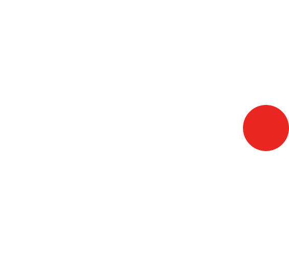

<div align="center">



# KEYWE

**Native Bluetooth HID Keyboard & Touchpad Remote for Android**

*Turn your Android smartphone into a zero-latency, hardware-emulated Bluetooth Keyboard and Multi-Touch Trackpad — with zero host software required on your PC.*

[](https://developer.android.com)
[](https://kotlinlang.org)
[](https://developer.android.com/jetpack/compose)
[](LICENSE)

---

</div>

## 📌 Overview

**Keywe** turns your phone into a native Bluetooth HID peripheral (Human Interface Device). Using Android’s `BluetoothHidDevice` framework, Keywe communicates directly with host operating systems at the hardware protocol layer.

Unlike traditional remote control apps, **Keywe requires ZERO software, drivers, server apps, or scripts installed on your computer.** Your PC, Mac, or Smart TV detects your phone as an out-of-the-box physical Bluetooth Keyboard and Mouse.

---

## ✨ Key Features & Capabilities

### 💻 Zero Host Setup
- **Plug-and-Play Out-of-the-Box**: Works seamlessly with **Windows 10/11**, **macOS**, **Linux**, **ChromeOS**, **Android TV**, and **Game Consoles**.
- **No Background PC Drivers**: Zero server app or host script installation required.

### ⌨️ Full 75% Mechanical Keyboard Layout
- **Authentic Physical Proportions**: Complete 75% layout with Function Keys row (`F1` - `F12`), `Esc` (Signal Red), `Del`, `Enter` (Signal Red), and dedicated arrow cluster (`▲`, `◄`, `▼`, `►`).
- **Tactile Spacebar**: Wide light-grey spacebar with bold "SPACE" labeling for effortless thumb typing.
- **Full Modifier & Hotkey Support**: Native support for `Ctrl`, `Alt`, `Shift`, `Win`, and `Fn` combinations.

### 🔄 Dynamic Orientation & Custom Rotate Controls
- **One-Tap Orientation Switcher**: Integrated custom rotation control button in the header bar to seamlessly flip between Portrait and Landscape modes.
- **Landscape Widescreen Split View**: Left side multi-touch trackpad + Right side 75% mechanical keyboard deck for ergonomic two-handed control.

### 🖱️ Multi-Touch Gesture Trackpad
- **Smooth Cursor Navigation**: Dynamic relative delta pointer tracking with customizable sensitivity (`0.5x` - `2.5x`).
- **Natural Gestures**:
  - **Single-finger tap**: Left Click
  - **Two-finger tap**: Right Click
  - **Two-finger vertical swipe**: Smooth Vertical Scrolling
- **Tactile Click Pads**: Dedicated `[ L-CLICK ]` and `[ R-CLICK ]` hardware buttons with dual-trigger haptic vibration pulses.

### ⚡ Overhauled Dual-Executor Bluetooth HID Engine
- **High-Priority Report Executor**: Dedicated single-thread foreground executor for zero-latency input transmission without UI stutter.
- **Real-Time Link Verification**: Queries `getDevicesMatchingConnectionStates()` live to ensure accurate status tracking across app reopens.
- **Remote Disconnect Detection**: Listens to `ACTION_ACL_DISCONNECTED` events to immediately update state when PC Bluetooth is turned off or out of range.
- **Smooth Auto-Retry Connection**: Auto-retries connection negotiation and prevents system Toast disconnect glitches.

### 📜 Continuous Marquee Status Ticker
- **Never Truncated**: Long status and error messages automatically scroll horizontally (`basicMarquee()`) across the header bar, with automatic `SignalRed` highlighting for errors.

### 📱 Dual Keyboard Engines (Tactile + Phone IME)
- **Built-in Tactile Keyboard**: Monochrome retro mechanical keycaps with haptic feedback.
- **System Soft Keyboard (Phone IME)**: Long-press **`[ KEYBOARD ]`** mode button to use your phone's default input method (voice typing, swipe, Gboard, SwiftKey).

### ⚙️ Minimalist Tactile Theme & Preferences
- **Curated Color Themes**: `MONOCHROME DARK`, `MATRIX GREEN`, `CYBER AMBER`, `TACTILE WHITE`.
- **Haptic Feedback Toggle**: Dual-trigger `LocalHapticFeedback` + native 25ms `Vibrator` pulses with custom track styling.

---

## 🛠️ Architecture & Tech Stack

```
           +-------------------------------------------------------+
           |                 Keywe Android App                     |
           |   (Jetpack Compose UI + Dot-Matrix Design System)     |
           +-------------------------------------------------------+
                                       |
                                       v
           +-------------------------------------------------------+
           |               BluetoothHidManager Engine              |
           |   (Dual-Executor Architecture + Live State Sync)      |
           +-------------------------------------------------------+
                                       |
                                       v
           +-------------------------------------------------------+
           |           USB HID Combo Report Descriptor             |
           |      (Report ID 1: Mouse | Report ID 2: Keyboard)     |
           +-------------------------------------------------------+
                                       |
                            Bluetooth L2CAP Link
                                       |
                                       v
           +-------------------------------------------------------+
           |              Host PC / Mac / Smart TV                 |
           |     (Native OS HID Driver: hidbth.sys / bthport)      |
           +-------------------------------------------------------+
```

| Layer | Technology |
|---|---|
| **Language** | Kotlin 2.0.0 |
| **UI Framework** | Jetpack Compose (Material 3) |
| **Design Language** | Dark Monochrome (`#0A0A0B`), Dot-Matrix Typography, LED Status Accents |
| **Bluetooth Stack** | Android `BluetoothHidDevice` API, BLE HID Profile, L2CAP Sockets |
| **Min SDK** | API Level 24 (Android 7.0 "Nougat") |
| **Target SDK** | API Level 36 (Android 15) |

---

## 🚀 Quick Start Guide

### Prerequisites
- An Android device running **Android 9.0 (API Level 28)** or higher (with hardware `BluetoothHidDevice` profile support).
- A host PC/laptop with Bluetooth capability.

### Connection Steps
1. **Launch Keywe**: Open **Keywe** on your phone (verify status header displays `🔴 PAIRED / READY`).
2. **Open Device Manager**: Tap the LED status badge in the top header.
3. **Select or Pair PC**: Tap your PC under **PAIRED** or search under **NEARBY** tab.
4. **Disconnect Anytime**: Tap **`DISCONNECT`** directly on any active device card to drop the link.

---

## ⚙️ Building From Source

1. Clone the repository:
   ```bash
   git clone https://github.com/shejanahmmed/Keywe.git
   cd Keywe
   ```

2. Build debug APK using Gradle:
   ```powershell
   .\gradlew.bat assembleDebug
   ```

3. Install on connected device:
   ```powershell
   .\gradlew.bat installDebug
   ```

---

## 👤 Author

**Farjan Ahmmed (Shejan)**  
*Software Engineer*

[](mailto:farjan.swe@gmail.com)
[](https://github.com/shejanahmmed)
[](https://www.linkedin.com/in/farjan-ahmmed/)
[](https://www.facebook.com/beingshejan/)
[](https://www.instagram.com/iamshejan/)

---

## 📄 License

This project is licensed under the MIT License — see the [LICENSE](LICENSE) file for details.
