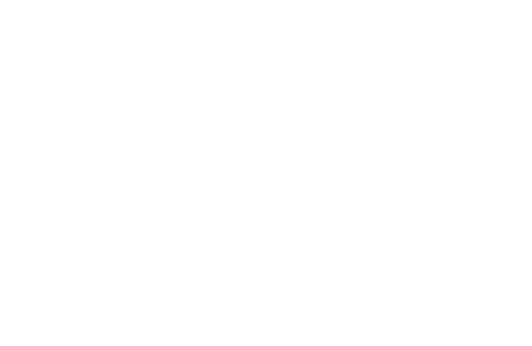

<div align="center">



# KEYWE

**Native Bluetooth HID Keyboard & Touchpad Remote for Android**

*Turn your Android smartphone into a zero-latency, hardware-emulated Bluetooth Keyboard and Multi-Touch Trackpad — with zero host software required on your PC.*

[](https://developer.android.com)
[](https://kotlinlang.org)
[](https://developer.android.com/jetpack/compose)
[](LICENSE)

---

</div>

## 📌 Overview

**Keywe** turns your phone into a native Bluetooth HID peripheral (Human Interface Device). Using Android’s `BluetoothHidDevice` framework, Keywe communicates directly with host operating systems at the hardware protocol layer.

Unlike traditional remote control apps, **Keywe requires ZERO software, drivers, server apps, or scripts installed on your computer.** Your PC, Mac, or Smart TV detects your phone as an out-of-the-box physical Bluetooth Keyboard and Mouse.

---

## ✨ Features

### 💻 Zero Host Setup
- **Plug-and-Play Out-of-the-Box**: Works seamlessly with **Windows 10/11**, **macOS**, **Linux**, **ChromeOS**, **Android TV**, and **Game Consoles**.
- **No Background PC Drivers**: Zero server app or host script installation required.

### ⌨️ 75% Mechanical Keyboard Deck
- **Authentic Physical Proportions**: Wide physical spacebar (`5.5x`), accented **Signal Red ESC** keycap, bottom-row modifiers (`CTRL`, `WIN`, `ALT`), and dedicated arrow keys cluster (`▲ ▼ ◄ ►`).
- **Quick Macro Shortcuts**: Dedicated hotkey caps for `WIN+D`, `ALT+TAB`, `WIN+L`, `COPY`, `PASTE`, and `BKSP`.

### 🔄 Landscape Widescreen & Side-by-Side Split View
- **Ergonomic Two-Handed Typing**: Rotate device horizontally to transform phone or tablet into a physical-feel two-handed keyboard deck.
- **Side-by-Side Split View**: Left 42% width for Touchpad & click pads + Right 58% width for Mechanical Keyboard Deck.

### 🖱️ Multi-Touch Gesture Trackpad
- **Smooth Cursor Navigation**: Dynamic relative delta pointer tracking with customizable sensitivity (`0.5x` - `2.5x`).
- **Natural Gestures**:
  - **Single-finger tap**: Left Click
  - **Two-finger tap**: Right Click
  - **Two-finger vertical swipe**: Smooth Vertical Scrolling
- **Tactile Click Pads**: Dedicated `[ L-CLICK ]` and `[ R-CLICK ]` hardware buttons.

### 📱 System Soft Keyboard (PHONE IME) Engine
- **Default Phone Keyboard Integration**: Click and hold (long-press) the **`[ KEYBOARD ]`** mode button to switch to System Keyboard mode. Type using any default phone soft keyboard (Gboard, SwiftKey, Samsung Keyboard, Voice Input, or Swipe).

### ⚙️ Theme & Preferences Modal
- **Preset Accent Palettes**: `MONOCHROME RED`, `MATRIX GREEN`, `CYBER AMBER`, `TACTILE WHITE`.
- **In-App Documents**: Integrated License & Privacy Policy access.

---

## 🛠️ Architecture & Tech Stack

```
           +-------------------------------------------------------+
           |                 Keywe Android App                     |
           |  (Jetpack Compose UI + Dot-Matrix Design System)      |
           +-------------------------------------------------------+
                                       |
                                       v
           +-------------------------------------------------------+
           |               BluetoothHidManager Engine              |
           |   (4-Stage Resilient SDP Registration & QoS Fallback) |
           +-------------------------------------------------------+
                                       |
                                       v
           +-------------------------------------------------------+
           |           USB HID Combo Report Descriptor             |
           |      (Report ID 1: Mouse | Report ID 2: Keyboard)     |
           +-------------------------------------------------------+
                                       |
                           Bluetooth L2CAP Link
                                       |
                                       v
           +-------------------------------------------------------+
           |              Host PC / Mac / Smart TV                 |
           |     (Native OS HID Driver: hidbth.sys / bthport)      |
           +-------------------------------------------------------+
```

| Layer | Technology |
|---|---|
| **Language** | Kotlin 2.0.0 |
| **UI Framework** | Jetpack Compose (Material 3) |
| **Design Language** | Dark Monochrome (`#0A0A0B`), Dot-Matrix Typography, LED Status Accents |
| **Bluetooth Stack** | Android `BluetoothHidDevice` API, BLE HID Profile, L2CAP Sockets |
| **Min SDK** | API Level 24 (Android 7.0 "Nougat") |
| **Target SDK** | API Level 36 (Android 15) |

---

## 🚀 Quick Start Guide

### Prerequisites
- An Android device running **Android 9.0 (API Level 28)** or higher (with hardware `BluetoothHidDevice` profile support).
- A host PC/laptop with Bluetooth capability.

### Connection Steps
1. **Unpair Previous Sessions**: If your phone was previously paired with your PC, remove it under **Windows Settings -> Bluetooth & devices**.
2. **Launch Keywe**: Open **Keywe** on your phone (verify status header displays `🔴 PAIRED / READY`).
3. **Make Discoverable**: Tap **"MAKE DISCOVERABLE"** inside the app.
4. **Pair from Host PC**: On your computer, click **Add Bluetooth Device** and select your phone.
5. **Start Remote Control**: Use the **Touchpad**, **Split View**, or **Keyboard** modes to control your PC instantly!

---

## ⚙️ Building From Source

1. Clone the repository:
   ```bash
   git clone https://github.com/shejanahmmed/Keywe.git
   cd Keywe
   ```

2. Build debug APK using Gradle:
   ```powershell
   .\gradlew.bat assembleDebug
   ```

3. Install on connected device:
   ```powershell
   .\gradlew.bat installDebug
   ```

---

## 👤 Author

**Farjan Ahmmed (Shejan)**  
*Software Engineer*

[](mailto:farjan.swe@gmail.com)
[](https://github.com/shejanahmmed)
[](https://www.linkedin.com/in/farjan-ahmmed/)
[](https://www.facebook.com/beingshejan/)
[](https://www.instagram.com/iamshejan/)

---

## 📄 License

This project is licensed under the MIT License — see the [LICENSE](LICENSE) file for details.
